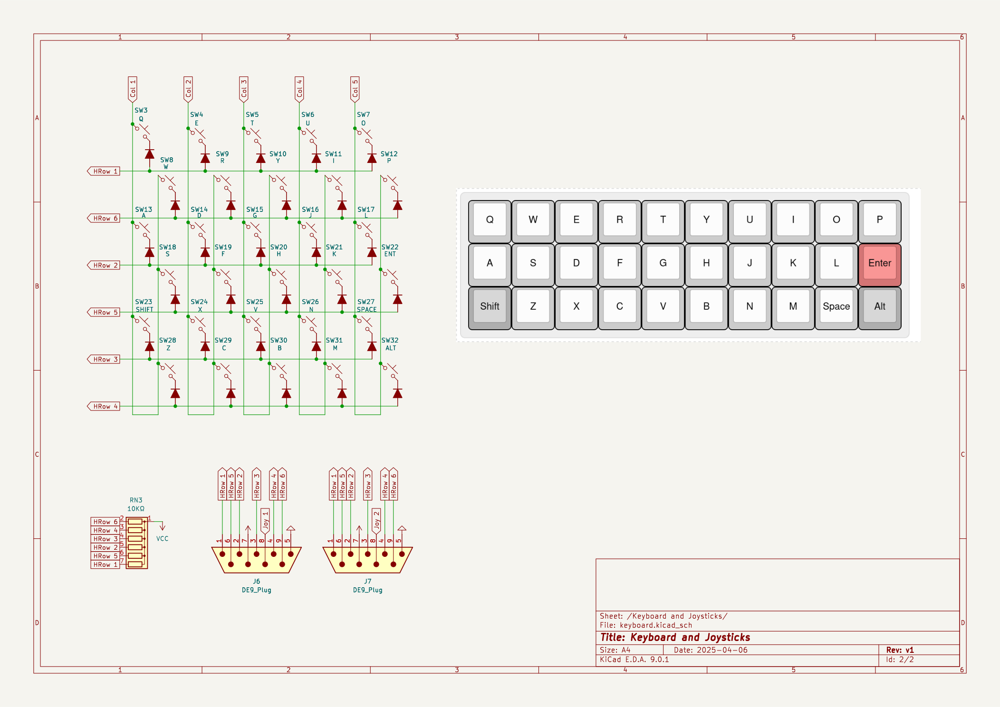
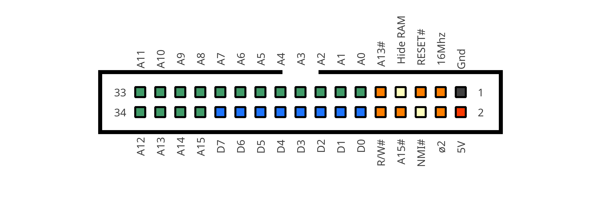

# MicroMicro


The MicroMicro (working name) is a project designed for a series I inteded(intend) to write, about how microcomputers work and how to go about developing one. It was designed to use a relatively small amount of integrated circuits (13), not use any programmable chips, microcontrollers or obselete parts, and to be a self-contained architecture that handles its own input and output (ie. not serial based).

With these requirements in mind, the overall specs are humble but capable:
* an 65c02 8bit cpu, running at 2Mhz
* 32KiB of ram, 8K of which are video ram
* 256x240 black and white display, via vga
* 1bit "beeper" audio
* Ultra-compact 30 Key keyboard using the "gherkin" layout
* Tape Interface for loading and storing data
* Cartridge port for rom programs and peripheral expansion
* 2 atari-style joystick ports

*Potential Features*
* custom case made from pcbs

The software side is still up in the air, but I'm aiming for the following features:
* A text editor
* An high-level programming language (undecided on which)
* A built-in assembler
* Saving and loading via the tape interface

This code would likely be custom and documented to follow the article structure of the hardware side of things.




# Memory Map

```
+---------------------+-------+-----------+
| Name                | Size  | Location  |
+---------------------+-------+-----------+
| Zero Page & Stack   | 512   | 0000-01FF |
| Video Data          | 7680  | 0200-1FFF |
| General Purpose RAM | 24576 | 2000-7FFF |
| IO Registers        | 8192  | 8000-9FFF |
| Expansion ROM       | 8192  | C000-DFFF |
| Bios ROM            | 8192  | E000-FFFF |
+---------------------+-------+-----------+ 
* the area from A000-BFFF is an invalid bus conflict region
```

## Video Data Format

Each byte corresonds to a line of 8 horizontal pixels on the screen. The screen addresses are organized as 32x30 character cells of 8x8 pixels each. 8 Consecutive bytes build one character.

This non-linear format was chosen to speed up the rendering of characters to the screen.

## Keyboard and Joystick

The state of the keyboard and joysticks can be read at the following addresses:

```
+---------------------+-------    +-------------------+
| Name                | Address   | Value             |
+---------------------+-----------+-------------------+
| Keyboard Col 1      |    9FFE   | Q  A  Z  X  S  W  |
| Keyboard Col 2      |    9FFD   | E  D  C  V  F  R  | 
| Keyboard Col 3      |    9FFB   | T  G  sh al H  Y  |
| Keyboard Col 4      |    9FF7   | U  J  B  N  K  I  |
| Keyboard Col 5      |    9FEF   | O  L  M  sp en P  |
| Joystick 1          |    8FFF   | up dw lf ri tl tr |
| Joystick 2          |    97FF   | up dw lf ri tl tr |
+---------------------+-----------+-------------------+
```

## Beeper and Tape Interface

The Beeper is a 1bit register that is used for both audio generation and to load and save programs to tape. It can be accessed through the following registers:

```
+---------------------+-------------+-----------+
| Name                | Address     | Value     |
+---------------------+-------------+-----------+
| State               | 9FFF (read) | TB.. .... |
| Toggle Beeper       | FFFF (write)| 0000 0000 |
+---------------------+-------------+-----------+
T = Tape Input
B = Beeper State
```

The tape interface is a 4-pin trs connector that be connected directly to a computer using an appropriate aux cable.

> Note: While these registers can be accessed from alternative locations, the addresses and values on this table ensure no bus conflicts occur.

## Expansion Interface

The MicroMicro has an expansion interface that allows extending the base capabilities of the system in various ways:



## Generic Banked Expansion Rom

An 8KiB region is set aside in the memory map for expansion roms (`$C000-$DFFF`), the emulator implements a simple banked rom cartridge where the current bank can be switched by reading from `$A0xx`, where `xx` is the bank number, the selected bank is also automatically set to zero on reset.

The bios will automatically jump to address `$C008` on boot if it detects an expansion rom that begins with the sring `CART-RUN`.

Currently expansion roms can be loaded by dragging and dropping a file into the emulator window.

## IC List

The design uses only 12 integrated circuits:

* `65c02` - 8bit CPU
* `62256` - 32KiB SRAM
* `39SF010 or 28C64 or 27C256` - 8KiB Program ROM
* `74hc10` - Tripple 3inNAND
* `74hc14` - Hex inverter
* `74hc32` - Quad 2inOR
* `74hc166` - 8bit parallel-to-serial shift register
* `74hc174` - 6bit d-type latch
* `74hc541` - 8bit buffer
* `74hc590`*2 - 8bit Counters
* `74hc4520`- Dual 4bit Counters

# Operating System

The 8k bios provides a simple command line operating system with the following commands:

| Command               | Description                                    |
| --------------------- | ---------------------------------------------- |
| `help`                | Lists all available commands                   |
| `clear`               | Clears the display			                       |
| `file`                | The Size and Name of the currently loaded file |
| `new`                 | Create a new file                              |
| `name <name>`         | Rename the current file                        |
| `edit`                | Open the file editor                           |
| `save`                | Save file to tape                              |
| `load`                | Load file from tape                            |
| `run`    	            | Run Loaded File                                |
| `peek <addr> <bytes>` | Read contents of Memory                        |
| `poke <addr> <bytes>` | Write to Memory                                |
| `prun <addr>`         | Run a Machine Code Subroutine                  |

# Changelog

## A3
[Interactive BOM](https://raw.githack.com/smaldragon/MicroMicro/refs/heads/main/Kicad/a3/bom/ibom.html)
* Revert Speaker Connection

## A2
* Reset is now performed using a MCP-100 voltage supervisor, this primarly serves to replace the 74HC14 Schmitt Trigger Hex NOT with a 74HCT04, reducing delays, improving reliabiliy of the clock oscillator circuit, and freeing 1 NOT gate for the video circuit
* Video glitches (leftmost pixel column doubled on right, junk at the bottom of the screen) are now gone
* VGA video output is now better centered on the screen
* The small 6mm buzzer has been replaced with an header for a small speaker, improving volume and sound clarity
* Filtering capacitor added to data output
* Needless diodes removed
* Fixed footprint for headphone jack
* 2 additional M2 screw posts added to the center region of the board
* Schematic rearranged

