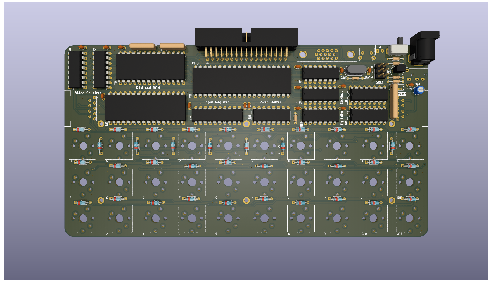
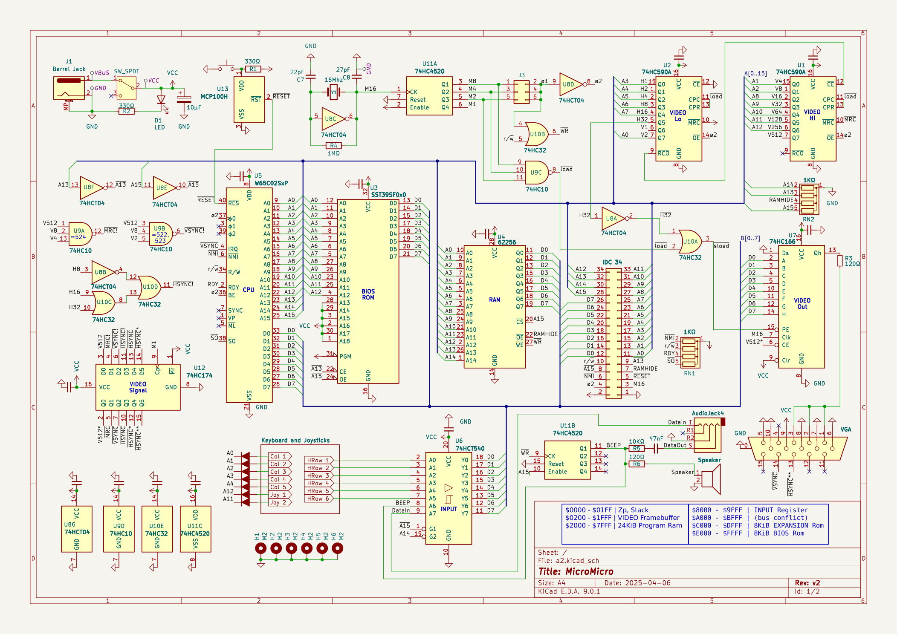

# MicroMicro





The MicroMicro (working name) is a project designed for a series I inteded(intend) to write, about how microcomputers work and how to go about developing one. It was designed to use a relatively small amount of integrated circuits (13), not use any programmable chips, microcontrollers or obselete parts, and to be a self-contained architecture that handles its own input and output (ie. not serial based).

With these requirements in mind, the overall specs are humble but capable:
* an 65c02 8bit cpu, running at 2Mhz
* 32KiB of ram, 8K of which are video ram
* 256x240 black and white display, via vga
* 1bit "beeper" audio
* Ultra-compact 30 Key keyboard using the "gherkin" layout
* Tape Interface for loading and storing data
* Cartridge port for rom programs and peripheral expansion
* 2 atari-style joystick ports

*Potential Features*
* custom case made from pcbs

The software side is still up in the air, but I'm aiming for the following features:
* A text editor
* An high-level programming language (undecided on which)
* A built-in assembler
* Saving and loading via the tape interface

This code would likely be custom and documented to follow the article structure of the hardware side of things.

# Memory Map

```
+---------------------+-------+-----------+
| Name                | Size  | Location  |
+---------------------+-------+-----------+
| Zero Page & Stack   | 512   | 0000-01FF |
| Video Data          | 7680  | 0200-1FFF |
| General Purpose RAM | 24576 | 2000-7FFF |
| IO Registers        | 16384 | 8000-BFFF |
| Expansion ROM       | 8192  | C000-DFFF |
| Bios ROM            | 8192  | E000-FFFF |
+---------------------+-------+-----------+ 
```

## Video Data Format

Each byte corresonds to a line of 8 horizontal pixels on the screen. The screen addresses are organized as 32x30 character cells of 8x8 pixels each. 8 Consecutive bytes build one character.

This non-linear format was chosen to speed up the rendering of characters to the screen.

## IO Register

```
The state of the keyboard and joysticks can be read at the following addresses:

+---------------------+-------+-----------------------+
| Name                | Location  | Keys              |
+---------------------+-----------+-------------------+
| Keyboard Col 1      |    BFFE   | Q  A  Z  X  S  W  |
| Keyboard Col 2      |    BFFD   | E  D  C  V  F  R  | 
| Keyboard Col 3      |    BFFB   | T  G  sh al H  Y  |
| Keyboard Col 4      |    BFF7   | U  J  B  N  K  I  |
| Keyboard Col 5      |    BFEF   | O  L  M  sp en P  |
| Joystick 1          |    9FFF   | up dw lf ri tl tr |
| Joystick 2          |    AFFF   | up dw lf ri tl tr |
+---------------------+-----------+-------------------+ 
```


## Beeper

The Beeper is a 1bit register that is used for both audio generation and to save programs to tape. Its state is toggled whenever a write to the ROM regions occurs `$C000-$FFFF`- Its current state can be read in bit 6 of the IO Register.